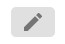
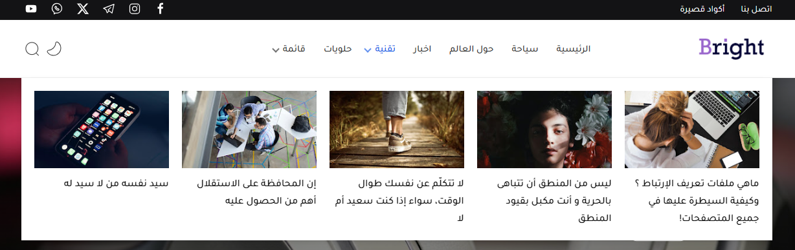

> قالب برايث لا يحتوي الكثير من التعقيدات حيث يمكن تركيبه وضبط اعداداته بكل سهولة كما يتم توفير تحديثات مجانية وتقديم الدعم الفني المجاني للمشترين.         
 :fas fa-dot-circle fa-fw: **اصدار القالب : 2.0**     
 :fas fa-dot-circle fa-fw:  [**صفحة القالب**](https://picalica.com/products/1806-%D8%A8%D8%B1%D8%A7%D9%8A%D8%AB-%D9%82%D8%A7%D9%84%D8%A8-%D8%A3%D9%86%D9%8A%D9%82-%D9%84%D9%84%D8%AA%D8%AF%D9%88%D9%8A%D9%86)            
 :fas fa-dot-circle fa-fw:   [**مصمم القالب**](https://picalica.com/u/SOUHAILLEKHOUAJA)

 **الميزات الرئيسية:**

 :fas fa-check fa-fw: تصميم متجاوب بالكامل

 :fas fa-check fa-fw: سرعة تحميل فائقة

 :fas fa-check fa-fw: محسن لمحركات البحث
(SEO)

 :fas fa-check fa-fw: دعم الوضع الليلي
    
# :fas fa-cog fa-fw: **تثبيت القالب**

اتبع هذه الخطوات بعناية لتثبيت القالب على مدونتك في بلوجر:
 
بعد تحميلك لملف القالب ستجده مضغوط بصيغة `.zip` قم بفك الضغط وادخل للمجلد ستلاحظ وجود ملف القالب بصيغة `.txt`

 
 :fas fa-dot-circle fa-fw: **من تبويب المظهر :**
 
**1-** نقوم بأخذ نسخة إحتياطية من القالب الحالي في المدونة بالضغط على زر **الاحتفاظ بنسخة احتياطية**

**2-** استخدم قالب من قوالب بلوجر الإفتراضية لتنظيف اكواد القالب القديم او استخدم قالب تنظيف.  [**رابط التحميل**](https://drive.google.com/uc?export=download&id=1vUKdDDoj7mHXzyM--BEjOdm8mmz2T14z)

**3-** نقوم بنسخ محتوى ملف القالب الذي تم تحميله.

**4-** نقوم بتحرير أكواد المدونة عن طريق الضغط على زر :  **تعديل HTML**

**أخيرًا -** نقوم بحذف جميع الأكواد الموجودة ولصق محتوى ملف القالب الذي قمنا بنسخه والضغط على زر **حفظ**  بعد الإنتهاء:

 ##  :fas fa-caret-left fa-fw: السماح بخلاصة المدونة

- افتح لوحة تحكم بلوجر الخاصة بك     
**1-** انتقل **للاعدادت**      
**2-** السماح بخلاصة المدونة       
**3-** ثم تختار **كامل** ثم **حفظ**      

 ##  :fas fa-caret-left fa-fw: أكواد الميتا
?> ملاحظة
أغلب أكواد الميتا في قالب برايت جاهزه وتعمل بشكل تلقائي حسب القيم التي يمكن استخلاصها من كل صفحة ، لكن بعض أكواد الميتا لابد من إضافتها بشكل يدوي داخل القالب .

الخطوات:
- نقوم بفتح تبويب المظهر
- ثم إختيار **تعديل HTML**
- نقوم بفتح تبويب **المظهر**
- سنجد في بداية الأكواد التعليق  `<!-- Required -->`
- بعد العنوان ستقوم بملئ البيانات والضغط على زر **الحفظ** بعد الانتهاء

 التعديلات المطلوبة:

?> اضف القيم الخاصه بك بين علاماتين `' '` المحددة في خانه `content`

- معرف ID تطبيق الفيس بوك
- معرف ID صفحة موقعك على تويتر.
- معرف ID حساب ادمن موقعك على تويتر.

##  :fas fa-caret-left fa-fw: تغيير صورة النشر البديله

?> 
الصورة البديلة هي التي تظهر تلقائيا في حاله عدم وجود صورة بالمقالات او عند نشر رابط الصفحة الرئيسية على مواقع التواصل الإجتماعي .

لتغيير صورة النشر البديله يمكنك اتباع الخطوات التاليه :

**1-**  اذهب الي تبويب **التنسيق**

**2-** ستجد في بداية الصفحة اداة **صورة النشر البديلة**

**3-** قم بفتح الاداة وغير الصورة واعمل **الحفظ** بعد الانتهاء

# :fas fa-bars-staggered fa-fw: **الهيدر**

 ##  :fas fa-caret-left fa-fw: الشعار

من خلالها يمكنك اضافة شعار مدونتك ليظهر في رأس الصفحة او يمكنك عرض عنوان مدونتك بدلا من الشعار .

**1-** اضغط على زر **التعديل**

**2-** تأكد من اختيار  (بدلاً من العنوان والوصف)

**3-** قُم بتحميل شعار المدونة 

**4-** ثُم اضغط على **حفظ**

?> الأبعاد المناسبة للشعار:   
**العرض:** `250px`
**الارتفاع:** `70px`

 ##  :fas fa-caret-left fa-fw:  **القائمة الرئيسية**

**1-** **الروابط العادية**

**-** اضغط على زر التعديل        
**-** في خانة **أسم الموقع الإلكتروني** يتم إضافة عنوان الرابط .   
**-** في خانة **عنوان URL للموقع الإلكتروني**  يتم إضافة الرابط .

?> مثال:   
اسم الموقع: `اخبار`   
رابط الموقع: `/search/label/news`  
استخدم `{homepage}` لجلب رابط الصفحة الرئيسية   

**2-** **القائمة المنسدلة الفردية**

`_`  قبل اسم الرابط الفرعي.

?> مثال:   
الرابط الأب: `منسدلة`  
**الروابط الفرعية:**   
`_منسدل 1`   
`_منسدل 2`   
`_منسدل 3`   

**3-** **القائمة المنسدلة المتعددة**

?> مثال:    
الرابط الأب: `منسدلة متعددة`    
**العناوين والروابط:**    
_عنوان 1    
__منسدل 1    
__منسدل 2    
_عنوان 2    
__منسدل 3    
__منسدل 4    

**4-** **عرض المشاركات (ميجا مينو)**

 قائمة الميجا مينيو تتيح لك عرض التدوينات بشكل جذاب داخل القائمة.      

- في خانة **أسم الموقع الجديد** يتم إضافة اسم التصنيف.   
- في خانة **عنوان URL للموقع الجديد** يتم إضافة هذا الكود: `{getMega} $label={تصنيف}`   
على سبيل المثال: `{getMega} $label={اخبار}`   
او استخدام `recent` لعرض اخر التتدوينات    

##  :fas fa-caret-left fa-fw: مواقع التواصل الإجتماعي

 يوجد في القالب موقعين لعرض أيقونات مواقع التواصل الإجتماعي الأول في الشريط العلوي والثاني في الفوتر     

يمكنك إضافة روابط مواقع التواصل الاجتماعي الخاصة بك باتباع الخطوات التالية:     
قم بادخال اسم موقع التواصل في الحقل  **اسم الموقع الجديد**   

**مواقع التواصل التي يدعمها القالب**    

`blogger`      
 `apple`   
 `amazon`      
 `microsoft`    
  `facebook`     
  `twitter`     
  `rss`    
  `youtube`    
  `skype`    
  `tumblr`  
  `stack-overflow`    
  `github`     
  `linkedin`      
  `dribbble`   
  `soundcloud`    
  `behance`     
  `instagram`    
  `pinterest`     
  `twitch`   
  `codepen`     
  `flipboard`       
  `reddit`                   
  `whatsapp`      
`telegram`        
 `messenger`               
 `snapchat`         
 `email`          
 `discord`   
 `quora`  
 `share`   
`external-link`   

ثم اضف الرابط في حقل ‏**عنوان URL للموقع الجديد** اضغط **اضف** رابط يمكن استخدام الأسهم على اليسار للترتيب ثم اضغط **حفظ**

 #  :fas fa-th-large fa-fw:  **اشكال عرض المواضيع**

هناك شكلين للمواضيع يمكن عرضها في الشريط الجانبي والفوتر فقط، باستعمال الكود التالي :

**الخطوات:**   
- افتح لوحة تحكم بلوجر
- اذهب الى قسم **التنسيق**
- اذهب لقسم السيدبار
- اضف أداة باسم **HTML/JAVASCRIPT**
- في خانة **العنوان** اضف العنوان الذي تريده
- في خانة **المحتوى** أضف الكود الذي بالاسفل 
- وبعد الإنتهاء قم بالضغط على **حفظ**

الكود : `{getWidget} $results={عدد التدوينات} $label={مصدر التدوينات}`   

**مصدر التدوينات:**    
لعرض تصنيف معين :  `label`   
لعرض اخر المواضيع  : `recent`  
لعرض التعليقات :     `comments`  

**مثال:**   
جلب تدوينات من تصنيف رياضة: `{getWidget} $results={3} $label={رياضة}`    
جلب أحدث التدوينات: `{getWidget} $results={3} $label={recent}`   
جلب التعليقات: `{getWidget} $results={3} $label={comments}`   

?> ملاحظة:  
نفس طريقة تنطبق على الفوتر 

 #  :fas fa-ad fa-fw:  **التحكم في الاعلانات**

**أولاً، نظام الإعلانات العام في القالب**   
اماكن وضع الاعلانات في صفحات القالب باللون الاصفر كما هو موضح بالصورة:

 
 **ثانيا، اضهار الإعلانات وسط المقال**

لاظهار الإعلانات وسط المقال في اي مكان تريده 
كل ما عليك فعله هو وضع هذا الكود في المكان الذي تريده
- الكود الاول:   `$ads={1}`     
- الكود الثاني:   `$ads={2}`        
مع اضافة **النمط الغامق** للكود       
**مثال:**     

 #  :fas fa-code fa-fw:  **أكواد قصيرة**

الأكواد القصيرة يمكن استخدامها داخل التدوينات او لعمل صفحات ثابته مثل صفحة نموذج الاتصال . 
ويتم إضافة الكود داخل تبويب **HTML**  أثناء كتابة المشاركة.

**الاكواد المدعومة**

|  |  |
|---|---|
| نموذج الاتصال | `{contactForm}` |
| الأكواد البرمجية | `{codeBox}` |
| عرض الموضوع بشكل كامل | `{fullWidth}` |

أضف الرمز القصير في المكان الذي تريده في الصفحة

 **مثال:**   

 ثم حدد الرمز القصير وأضف **النمط الغامق**.

 #  :fas fa-paint-brush fa-fw:  **تخصيص القالب**

> :fas fa-star fa-fw: هذا القسم هو التحكم من التخصيص وهو التحكم في ايقاف او تشغيل الخصائص وتغيير الخط وتغيير الألوان وتغير شكل القائمة العلوية الخ .. وفي هذا الشرح سنقوم بعرض جميع الخصائص التي يمكنك استخدامها من التخصيص مع شرح كيفية استخدامها

**اولا**  كيفية الدخول الي تخصيص القالب 
- من لوحة التحكم > المظهر > الضغط على زر **تخصيص**

هذة صورة متحركة توضيحية للعمليه السابقة

